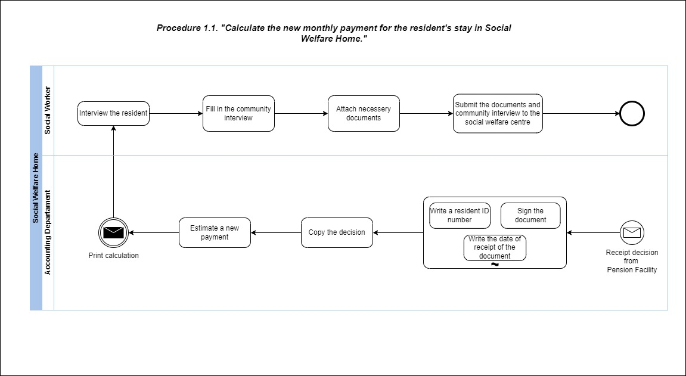
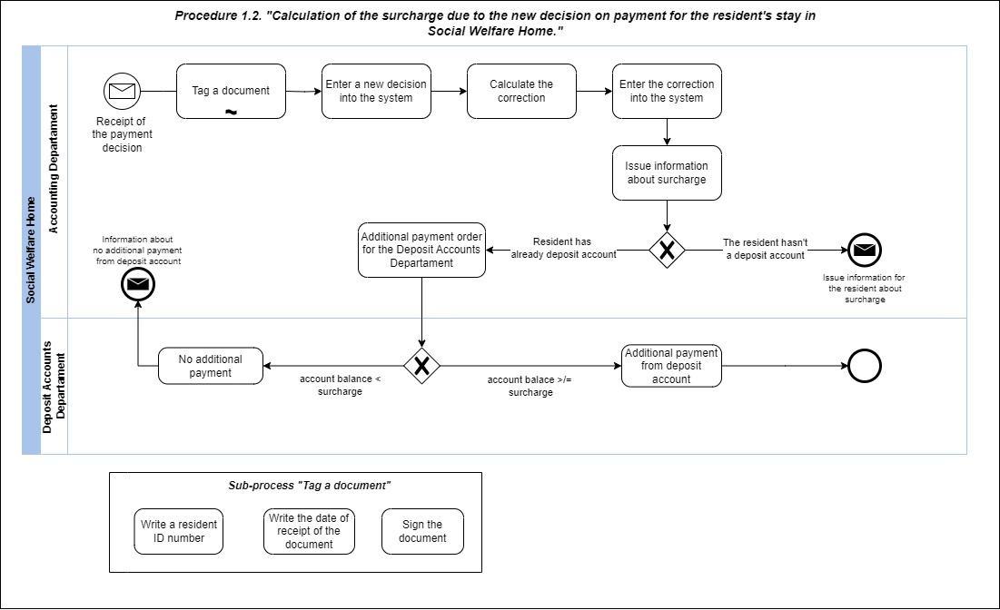

# Overview
These procedures are using in Social Welfare Home to calculate monthly resident's payment.

##_**Step by step**_

###Procedure 1.1.

Resident's monthly incomes are fundamental knowledge to calculate payment. Due to we need official documents about this (for example from Pension Facility). 
After we get them we can calculate monthly net income and estimate a new monthly payment. Interview resident and fill in the community interview are next steps done by Social Worker.
After attache necessery documents we can hand on them to social welfare centre.

###Procedure 1.2.

# Lessons learnt
On the way when I was creating the functionality I was facing following questions:
- how to divide activities into pools?
- 

